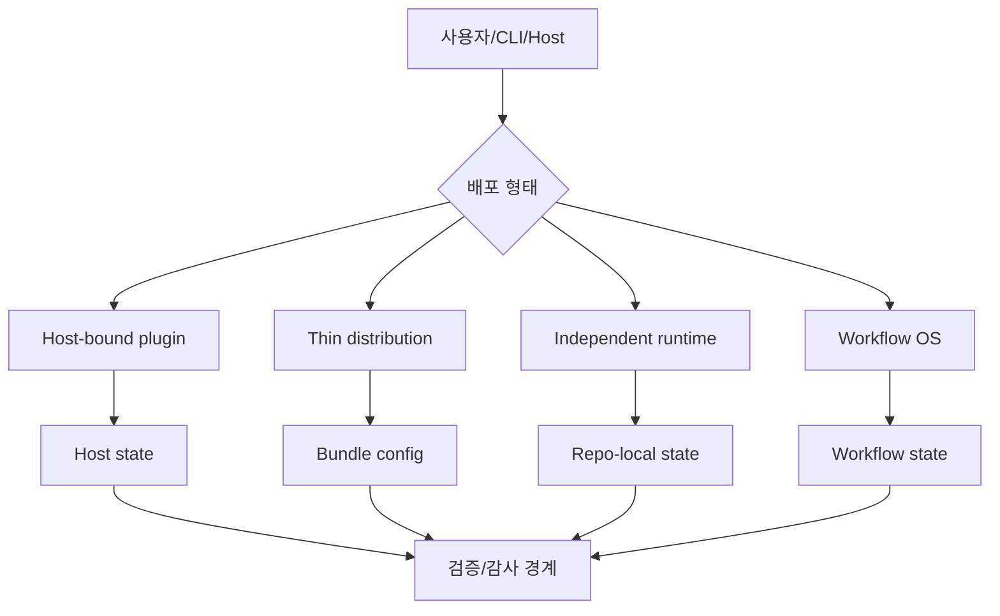

# 배포 형태와 상태 경계

## 학습 목표

이 장의 목표는 AI 코딩 하네스가 plugin, CLI, local runtime, bridge, workflow OS 중 어떤 형태로 배치되는지 이해하는 것입니다. 독자는 아키텍처를 “폴더 구조”가 아니라 **상태가 어디에 살고, 어떤 host에 붙으며, 어떤 경계가 안전을 만든다**는 관점으로 설명할 수 있어야 합니다.

## 요약

아키텍처는 하네스의 책임 경계를 결정합니다. opencode 같은 host 위에 붙는 plugin형, thin distribution overlay, 독립형 CLI/runtime, workflow OS는 각각 다른 장점과 제약을 갖습니다. 상태를 host에 둘지, repo-local 디렉터리에 둘지, 외부 서비스에 둘지도 중요한 설계 결정입니다.

## 핵심 개념

- **Host-bound plugin**: 기존 host의 lifecycle과 tool surface에 붙어 확장합니다.
- **Thin distribution**: 기존 도구 묶음을 특정 모델/CLI 환경에 맞게 배포합니다.
- **Independent runtime**: 자체 CLI, 상태 디렉터리, workflow state, tool session을 운영합니다.
- **State boundary**: `.gjc`, `.omo`, session file, ledger, plan artifact처럼 상태가 저장되는 경계입니다.
- **Bridge**: host와 core runtime 사이에서 protocol, path, permission, event를 변환합니다.

## 설계 패턴

### Host-neutral core + adapter split

core logic을 host-neutral하게 유지하고 adapter가 host별 차이를 담당합니다. 여러 host를 지원하기 쉬워지지만 adapter 경계가 흐려지면 core가 host 세부사항에 오염됩니다.

### Repo-local state boundary

workflow state와 ledger를 repo-local 디렉터리에 두면 실행 이력이 artifact와 함께 남습니다. 단, 무엇을 commit하고 무엇을 ignore할지 정책이 필요합니다.

### Plugin firewall

plugin이 host를 확장할 때 권한과 lifecycle을 제한하는 방화벽이 필요합니다. 그렇지 않으면 host 내부와 plugin 상태가 섞여 실패 원인 추적이 어려워집니다.

## 기존 근거 링크

- [아키텍처 비교](../../comparisons/architecture.md): 여섯 하네스의 배포 형태와 상태 경계를 비교합니다.
- [omo 분석](../../harnesses/omo.md): host-neutral core + adapter split 패턴을 확인합니다.
- [gajae-code 분석](../../harnesses/gajae-code.md): `gjc` CLI + `.gjc` runtime boundary를 확인합니다.
- [ouroboros 분석](../../harnesses/ouroboros.md): Python workflow OS + plugin firewall 접근을 확인합니다.

## 다이어그램

캡션: 아키텍처 선택은 배포 형태와 상태 저장 위치를 결정하고, 그 결과 검증과 감사 경계가 달라집니다.

텍스트 설명: 하네스는 host plugin, thin distribution, 독립 runtime, workflow OS 중 하나 또는 혼합 형태로 배치됩니다. 각 형태는 상태가 저장되는 위치와 검증할 경계를 다르게 만듭니다.

## 핵심 질문

- 이 하네스는 기존 host에 붙는가, 자체 runtime을 갖는가?
- 상태는 host 내부, repo-local 디렉터리, 외부 서비스 중 어디에 저장되는가?
- adapter가 host 차이를 충분히 격리하는가?
- 사용자가 artifact와 audit trail을 어디서 확인할 수 있는가?

## 관련 링크와 Backlinks

- [학습 경로](../learning-path.md)
- [문서 맵](../document-map.md)
- [용어집 — 아키텍처](../glossary.md#5-아키텍처)
- [개념 색인 — 플러그인형 아키텍처](../concept-index.md)
- [패턴 색인 — Host-neutral adapter split](../pattern-index.md)
- [framework](../../framework.md)
