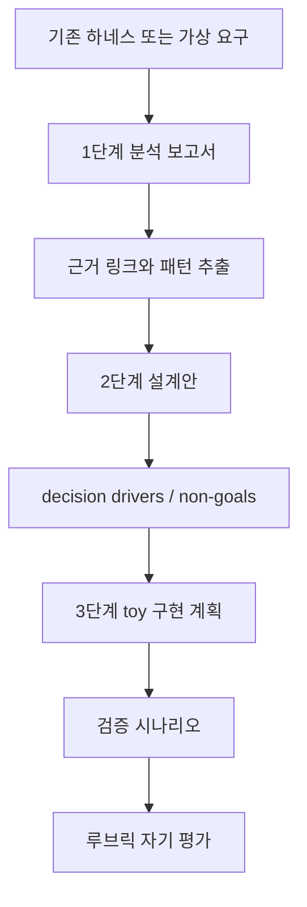

# Capstone: 분석 보고서 → 설계안 → toy 구현 계획

## 학습 목표

이 장의 목표는 지금까지 배운 개념을 하나의 산출물 흐름으로 묶는 것입니다. 독자는 기존 또는 가상의 AI 코딩 하네스를 분석하고, 근거 링크가 붙은 설계안을 만들고, 작은 toy 구현 계획으로 줄여 실제 실행 가능한 범위를 정의할 수 있어야 합니다.

## 요약

Capstone은 대형 구현을 요구하지 않습니다. 목표는 **직접 설계 능력**을 증명하는 것입니다. 세 단계는 순서가 중요합니다. 먼저 분석 보고서로 기존 패턴을 읽고, 설계안으로 자신의 결정을 명시하고, toy 구현 계획으로 가장 작은 검증 가능한 형태까지 내립니다.

## 핵심 개념

- **분석 보고서**: 대상 하네스를 5개 비교 차원으로 분해하고 근거 링크를 붙입니다.
- **설계안**: 목표, non-goals, 도구 표면, 루프, prompt, architecture, model routing, verification을 결정합니다.
- **toy 구현 계획**: 실제 구현 가능한 최소 파일 구조와 검증 시나리오로 축소합니다.
- **루브릭**: 분석 정확성, 설계 일관성, 근거 링크, 구현 가능성을 평가합니다.

## 설계 패턴

### Evidence chain capstone

capstone의 모든 결정은 기존 문서 근거 또는 명시적 가정으로 이어져야 합니다. 근거 없는 “좋아 보이는 설계”는 통과하지 않습니다.

### Smallest useful implementation plan

toy 구현 계획은 완성 제품이 아니라 학습 검증 단위입니다. 하나의 CLI, 하나의 loop, 하나의 tool surface처럼 작고 검증 가능한 범위로 줄입니다.

### Rubric-first self review

산출물을 만든 뒤 루브릭을 보는 것이 아니라, 처음부터 루브릭의 네 기준을 목차로 삼습니다. 그러면 분석과 설계가 검증 가능한 형태로 유지됩니다.

## 기존 근거 링크

- [framework](../../framework.md): 5개 비교 차원과 인용 규칙을 제공합니다.
- [README 요약 매트릭스](../../README.md#요약-매트릭스): 하네스별 설계 접근을 빠르게 비교합니다.
- [루프 엔지니어링 비교](../../comparisons/loop-engineering.md): toy 구현 계획의 loop 설계 근거로 사용합니다.
- [gajae-code 분석](../../harnesses/gajae-code.md): workflow와 receipt 기반 검증 설계를 참고합니다.
- [Ouroboros 분석](../../harnesses/ouroboros.md): spec-first 루프와 ambiguity gate를 참고합니다.

## 다이어그램

캡션: Capstone은 분석 보고서에서 패턴과 근거를 추출하고, 설계안으로 결정을 명시한 뒤, toy 구현 계획과 루브릭 평가로 마무리합니다.

텍스트 설명: 독자는 먼저 대상 하네스를 분석하고 근거 링크를 붙입니다. 그 근거에서 설계 결정을 만들고, 마지막으로 가장 작은 구현 계획과 검증 시나리오를 작성합니다.

## 3단계 capstone 안내

### 1단계 — 분석 보고서

- 템플릿: [analysis-report-template.md](../exercises/analysis-report-template.md)
- 목표: 대상 하네스를 5개 비교 차원으로 분해합니다.
- 필수 근거: 각 차원마다 기존 분석 문서 또는 source permalink 링크를 둡니다.
- 완료 기준: “이 하네스가 어떤 substrate와 loop를 갖는가?”를 가치중립 명사구로 요약합니다.

### 2단계 — 설계안

- 템플릿: [design-proposal-template.md](../exercises/design-proposal-template.md)
- 목표: 새 하네스의 목표, non-goals, 도구 표면, 루프, prompt, architecture, model routing, verification을 결정합니다.
- 필수 근거: 각 decision driver가 어떤 기존 패턴에서 왔는지 링크합니다.
- 완료 기준: tradeoff를 숨기지 않고 “왜 이 선택을 했는가”를 설명합니다.

### 3단계 — toy 구현 계획

- 템플릿: [toy-implementation-plan-template.md](../exercises/toy-implementation-plan-template.md)
- 목표: 설계안을 가장 작은 검증 가능한 구현 단위로 줄입니다.
- 필수 근거: 구현 범위가 설계안의 어떤 decision을 검증하는지 연결합니다.
- 완료 기준: 파일 구조, 구현 단계, 검증 시나리오, 실패 처리 기준이 있습니다.

## 핵심 질문

- 내 분석 보고서는 5개 차원을 모두 다루는가?
- 설계안의 decision driver는 기존 문서 근거와 연결되는가?
- toy 구현 계획은 정말 작은가, 아니면 완제품 구현으로 부풀었는가?
- 루브릭의 네 기준 중 가장 약한 항목은 무엇인가?

## 관련 링크와 Backlinks

- [학습 경로](../learning-path.md)
- [문서 맵](../document-map.md)
- [분석 보고서 템플릿](../exercises/analysis-report-template.md)
- [설계안 템플릿](../exercises/design-proposal-template.md)
- [toy 구현 계획 템플릿](../exercises/toy-implementation-plan-template.md)
- [예시](../exercises/examples.md)
- [루브릭](../exercises/rubric.md)
- [framework](../../framework.md)
