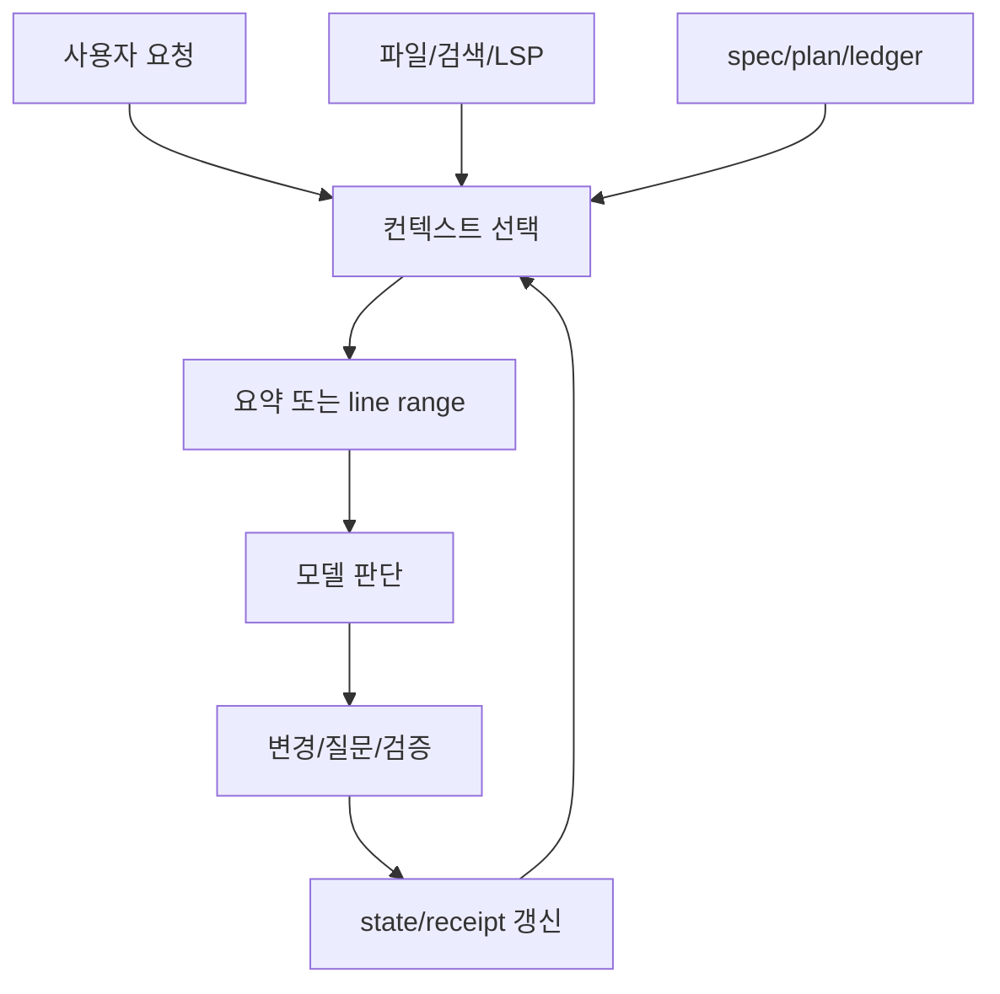

# 컨텍스트 공급 설계

## 학습 목표

이 장의 목표는 AI 코딩 하네스가 모델에게 어떤 정보를, 언제, 어떤 크기로 제공해야 하는지 판단하는 법을 익히는 것입니다. 독자는 컨텍스트를 “많이 넣기”가 아니라 **선택·요약·근거화·갱신**의 문제로 볼 수 있어야 합니다.

## 요약

컨텍스트 공급은 모델의 판단 재료를 정하는 설계입니다. 파일 전체를 무작정 넣으면 비용과 혼란이 커지고, 너무 적게 넣으면 환각과 잘못된 변경이 늘어납니다. 좋은 하네스는 검색, 구조 요약, anchor, state, spec, transcript를 조합해 필요한 순간에 필요한 근거만 제공합니다.

## 핵심 개념

- **컨텍스트 소스**: 사용자 요청, 파일, 검색 결과, LSP 정보, workflow state, ledger, spec, plan.
- **컨텍스트 단위**: raw file, line range, symbol summary, receipt, Q&A summary, ontology, pinned source link.
- **컨텍스트 갱신**: 파일이 바뀌거나 state가 checkpoint되면 이전 정보가 stale이 될 수 있습니다.
- **컨텍스트 예산**: 긴 대화와 대형 문서를 요약·선별하지 않으면 중요한 근거가 prompt 밖으로 밀립니다.

## 설계 패턴

### Prompt-safe summary

긴 초기 요구나 히스토리를 그대로 모델에 넣지 않고, 결정·제약·미해결 gap·파일 링크를 보존한 요약으로 바꿉니다. Deep Interview의 prompt-budget 규칙과 잘 맞는 패턴입니다.

### Evidence anchor context

코드나 문서의 특정 줄을 line range, hashline, permalink로 가리키면 모델과 reviewer가 같은 근거를 봅니다. 이 레포의 기존 분석 문서는 고정 SHA와 line range를 사용합니다.

### State-backed context

ledger와 receipt는 “무엇을 했다고 주장하는가”를 저장합니다. 다음 agent나 다음 turn은 기억이 아니라 state를 읽어 이어갈 수 있습니다.

## 기존 근거 링크

- [framework — 인용 규칙](../../framework.md): 고정 SHA와 line range 중심의 근거 규칙입니다.
- [Ouroboros 분석](../../harnesses/ouroboros.md): Seed/Workflow IR과 스펙 주도 컨텍스트를 확인합니다.
- [gajae-code 분석](../../harnesses/gajae-code.md): `.gjc` runtime state와 workflow receipt를 확인합니다.
- [하네스 엔지니어링 비교](../../comparisons/harness-engineering.md): 컨텍스트 공급이 하네스 엔지니어링 차원에 놓이는 이유를 봅니다.

## 다이어그램

캡션: 컨텍스트 공급은 요청·파일·상태를 선별하고, 요약 또는 line range로 모델에 전달한 뒤 결과를 다시 state로 갱신하는 순환 구조입니다.

텍스트 설명: 모델은 모든 정보를 직접 보지 않습니다. 하네스가 사용자 요청, 파일, spec, plan, ledger에서 필요한 부분을 선택해 제공하고, 변경 후에는 receipt나 state를 갱신해 다음 판단의 입력으로 만듭니다.

## 핵심 질문

- 이 작업에 필요한 사실은 파일, symbol, prior decision, user answer 중 어디에 있는가?
- raw content를 넣어야 하는가, 요약이나 line range로 충분한가?
- 지금 보고 있는 context는 최신인가?
- 완료 후 어떤 state나 receipt를 갱신해야 다음 작업이 안전한가?

## 관련 링크와 Backlinks

- [학습 경로](../learning-path.md)
- [문서 맵](../document-map.md)
- [용어집 — 컨텍스트 공급](../glossary.md#9-컨텍스트-공급)
- [개념 색인 — 컨텍스트 공급](../concept-index.md)
- [패턴 색인 — Hashline anchor context](../pattern-index.md)
- [framework](../../framework.md)
