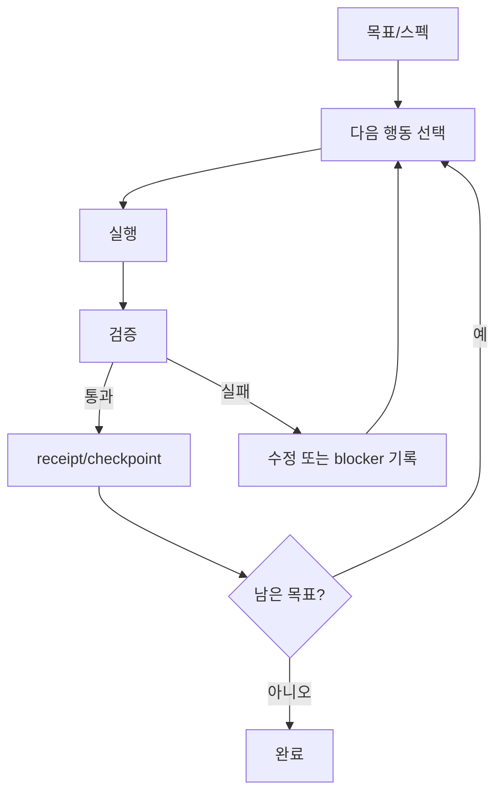

# 반복 제어와 검증 루프

## 학습 목표

이 장의 목표는 AI 코딩 하네스가 한 번의 모델 응답으로 끝나지 않고, 계획·실행·검증·수정·중단을 어떻게 반복하는지 이해하는 것입니다. 독자는 루프를 “계속 시키는 장치”가 아니라 **언제 멈추고 무엇을 증거로 남길지 정하는 제어 구조**로 볼 수 있어야 합니다.

## 요약

루프 엔지니어링은 agent가 다음 행동을 선택하고 완료를 주장하기까지의 제어 흐름입니다. continuation loop, verify/fix loop, receipt ledger loop, spec-first evolution은 모두 반복 구조지만 목적이 다릅니다. 좋은 루프는 명확한 목표, 상태 기록, 실패 경로, 종료 조건, 재검증을 갖습니다.

## 핵심 개념

- **반복 상태**: 현재 목표, 남은 작업, blocker, 검증 결과, receipt.
- **종료 조건**: 테스트 통과, ambiguity threshold, reviewer 승인, ledger checkpoint, hard cap.
- **재시도 경로**: 실패를 감추는 fallback이 아니라 원인과 다음 행동을 기록하는 경로입니다.
- **완료 주장**: 완료는 말이 아니라 현재 상태 증거와 quality gate로 닫습니다.

## 설계 패턴

### Continuation loop

긴 작업을 여러 turn에 걸쳐 이어갈 때 목표를 잃지 않게 합니다. 단, 계속한다는 지시만 있으면 무한 반복 위험이 있으므로 완료 조건과 checkpoint가 필요합니다.

### Receipt ledger loop

작업 단위를 checkpoint하고 evidence, gate hash, goal snapshot을 남깁니다. 이 패턴은 기억에 의존하지 않고 audit trail로 이어가게 합니다.

### Spec-first evaluation loop

요구가 모호할 때 바로 구현하지 않고 spec을 만든 뒤 평가·진화합니다. Ouroboros와 Deep Interview 계열에서 특히 중요합니다.

## 기존 근거 링크

- [루프 엔지니어링 비교](../../comparisons/loop-engineering.md): 여섯 하네스의 루프 제어 차이를 비교합니다.
- [gajae-code 분석](../../harnesses/gajae-code.md): workflow·receipt ledger loop를 확인합니다.
- [ouroboros 분석](../../harnesses/ouroboros.md): ambiguity·evaluation·evolution gates를 확인합니다.
- [omo 분석](../../harnesses/omo.md): todo·continuation loop 사례를 확인합니다.

## 다이어그램

캡션: 안전한 루프는 실행 후 검증을 거쳐 checkpoint하거나 blocker를 기록하고, 남은 목표가 없을 때만 완료됩니다.

텍스트 설명: 루프는 목표에서 다음 행동을 선택하고 실행한 뒤 검증합니다. 검증이 실패하면 수정 또는 blocker 기록으로 돌아가고, 통과하면 receipt/checkpoint를 남긴 뒤 남은 목표를 확인합니다.

## 핵심 질문

- 이 루프는 어떤 상태를 기억하고 어떤 상태를 버리는가?
- 실패했을 때 fallback이 문제를 숨기는가, 아니면 blocker를 드러내는가?
- 완료 전에 어떤 검증이 반드시 다시 실행되는가?
- 루프 종료 조건이 사용자 승인, 테스트, 평가 점수 중 무엇에 의해 결정되는가?

## 관련 링크와 Backlinks

- [학습 경로](../learning-path.md)
- [문서 맵](../document-map.md)
- [용어집 — 루프 엔지니어링](../glossary.md#3-루프-엔지니어링)
- [개념 색인 — 검증 루프](../concept-index.md)
- [패턴 색인 — Receipt ledger loop](../pattern-index.md)
- [framework](../../framework.md)
