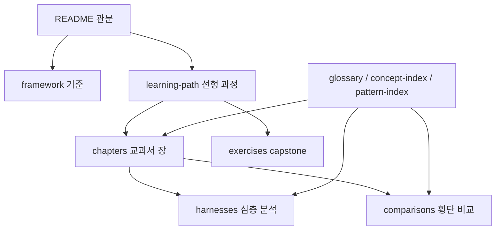

# 지도 읽기: 문서 지형과 학습 방법

## 학습 목표

이 장의 목표는 `harness-compare`를 단순 문서 묶음이 아니라 **근거 레이어 + 학습 레이어**로 읽는 방법을 익히는 것입니다. 독자는 어떤 질문을 가졌을 때 README, framework, 하네스 분석, 횡단 비교, `docs/` 챕터와 색인 중 어디로 가야 하는지 판단할 수 있어야 합니다.

## 요약

기존 분석 레이어는 “무엇을 근거로 말하는가?”에 답합니다. 새 학습 레이어는 “어떤 순서로 배우고, 어떻게 내 설계로 옮길 것인가?”에 답합니다. 먼저 [README](../../README.md)에서 전체 대상과 요약 매트릭스를 보고, [framework](../../framework.md)에서 비교 차원과 인용 규칙을 확인합니다. 그런 다음 [학습 경로](../learning-path.md)를 따라 챕터와 실습으로 이동합니다.

## 핵심 개념

- **근거 레이어**: `framework.md`, `harnesses/*.md`, `comparisons/*.md`. 설계 주장과 비교 판단의 출처입니다.
- **학습 레이어**: `docs/learning-path.md`, `docs/glossary.md`, `docs/concept-index.md`, `docs/pattern-index.md`, `docs/chapters/*.md`, `docs/exercises/*.md`. 독자가 개념을 배우고 산출물을 만드는 경로입니다.
- **게이트웨이 문서**: README는 전체 관문입니다. 자세한 학습 순서는 [학습 경로](../learning-path.md)에 둡니다.
- **위키형 왕복**: 색인에서 챕터로, 챕터에서 기존 분석으로, 기존 분석에서 다시 패턴 색인으로 이동합니다.

## 설계 패턴

### Evidence-first learning map

학습 문서가 독립된 주장 창고가 되면 쉽게 근거 없는 해설이 됩니다. 이 레포는 학습 문서를 기존 분석 문서 위에 얹습니다. 따라서 새 설명은 읽기 쉽게 풀어쓰되, 세부 판단은 [framework](../../framework.md)와 기존 분석 문서로 되돌아갑니다.

### Linear path + wiki index split

초급 독자는 [학습 경로](../learning-path.md)를 따라 선형으로 읽습니다. 중급 독자는 [개념 색인](../concept-index.md)이나 [패턴 색인](../pattern-index.md)에서 필요한 항목만 찾아 들어갑니다. 두 경로를 분리하면 README가 비대해지지 않고, 위키 탐색도 산만해지지 않습니다.

## 기존 근거 링크

- [README 요약 매트릭스](../../README.md#요약-매트릭스): 여섯 하네스 × 다섯 비교 차원의 관문입니다.
- [framework — 5개 비교 차원의 조작적 정의](../../framework.md): 모든 비교의 기준입니다.
- [하네스 엔지니어링 횡단 비교](../../comparisons/harness-engineering.md): 문서 간 비교가 어떻게 구성되는지 보여줍니다.
- [opencode 기준선 분석](../../harnesses/opencode.md): 기준선 문서가 어떤 역할을 하는지 확인할 수 있습니다.

## 다이어그램

캡션: `harness-compare`는 README에서 시작해 기준 문서, 학습 경로, 챕터, 실습, 기존 근거 문서로 왕복하는 구조를 갖습니다.

텍스트 설명: 선형 학습은 README와 learning-path에서 시작하고, 위키 탐색은 glossary/concept-index/pattern-index에서 시작합니다. 두 경로 모두 framework, harnesses, comparisons 근거 레이어로 되돌아갑니다.

## 핵심 질문

- 내가 지금 찾는 것은 용어 정의인가, 설계 패턴인가, 실제 근거인가?
- README에 넣어야 할 내용과 `docs/learning-path.md`로 보내야 할 내용은 어떻게 구분되는가?
- 새 학습 설명이 기존 분석 문서의 근거를 충분히 가리키고 있는가?

## 관련 링크와 Backlinks

- [학습 경로](../learning-path.md)
- [문서 맵](../document-map.md)
- [용어집](../glossary.md)
- [개념 색인](../concept-index.md)
- [패턴 색인](../pattern-index.md)
- [framework](../../framework.md)
