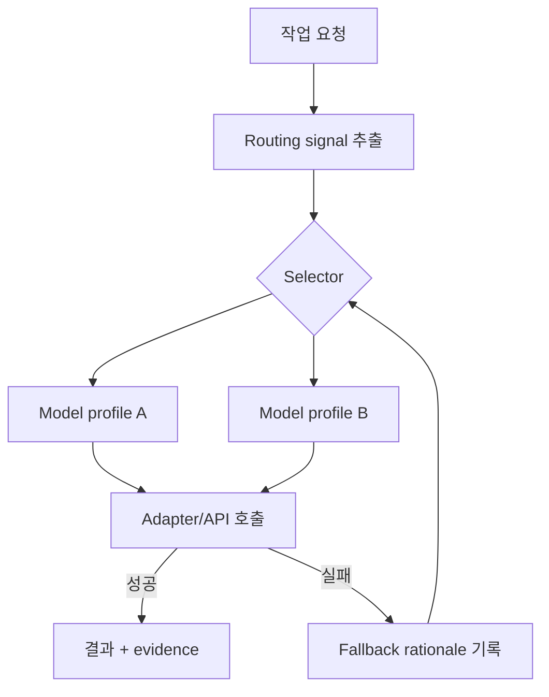

# 모델 분기와 fallback

## 학습 목표

이 장의 목표는 모델별 튜닝을 단순히 “더 좋은 모델 선택”이 아니라 provider, 모델 능력, prompt 형식, 비용, 실패 상황에 따른 분기 설계로 이해하는 것입니다. 독자는 routing table, adapter, fallback chain을 설계안에 명시할 수 있어야 합니다.

## 요약

모델별 튜닝은 특정 모델에 맞춘 prompt 문구 조정만이 아닙니다. 어떤 요청을 어떤 모델에 보낼지, 실패하면 어떻게 대체할지, 모델별 tool schema와 prompt asset을 어떻게 다룰지가 포함됩니다. fallback은 문제를 조용히 숨기기보다 실패 사실과 품질 한계를 드러내야 합니다.

## 핵심 개념

- **Routing signal**: 작업 종류, 위험도, 비용, latency, context size, required tools.
- **Model profile**: provider, model id, prompt 형식, tool capability, budget, fallback 후보.
- **Adapter**: provider별 API와 message shape 차이를 공통 interface 뒤로 숨기는 계층.
- **Fallback chain**: primary 실패 시 대체 모델 또는 대체 workflow를 선택하는 규칙.
- **Quality cap**: 불확실한 auto-answer나 fallback 결과가 지나치게 높은 확신으로 기록되지 않게 하는 제한입니다.

## 설계 패턴

### Selector/profile binding

selector가 작업 성격을 판정하고 profile이 실제 모델과 prompt/tool 형식을 결정합니다. 이 분리는 routing logic과 provider 세부사항을 나눕니다.

### Explicit fallback rationale

fallback이 발생하면 “왜 바뀌었는가”와 “품질에 어떤 제약이 생겼는가”를 state나 receipt에 남깁니다. 조용한 fallback은 디버깅과 품질 검증을 어렵게 만듭니다.

### Model-specific prompt catalog

모델별로 잘 작동하는 prompt asset을 관리하되, 의미상 같은 역할은 같은 계약을 유지해야 합니다. 모델별 튜닝이 역할 책임을 바꾸면 workflow 전체가 흔들립니다.

## 기존 근거 링크

- [모델별 튜닝 비교](../../comparisons/model-tuning.md): 여섯 하네스의 모델 분기와 튜닝 표면을 비교합니다.
- [gajae-code 분석](../../harnesses/gajae-code.md): selector/profile/thinking suffix binding을 확인합니다.
- [omo 분석](../../harnesses/omo.md): category·agent fallback routing을 확인합니다.
- [opencode 분석](../../harnesses/opencode.md): 모델 ID 기반 prompt/tool transform을 확인합니다.

## 다이어그램

캡션: 모델 라우팅은 요청 신호를 selector가 판정하고 profile/adapter를 통해 호출하며, 실패 시 fallback rationale을 기록하고 대체 경로로 돌아갑니다.

텍스트 설명: 작업 요청은 위험도, 도구 필요성, 비용 같은 signal로 분해됩니다. selector는 signal을 모델 profile에 매핑하고 adapter가 실제 provider 호출을 처리합니다. 실패하면 이유를 기록하고 fallback합니다.

## 핵심 질문

- routing 기준은 prompt에 숨어 있는가, 코드/설정/profile로 명시되어 있는가?
- fallback이 발생하면 사용자가 품질 한계를 알 수 있는가?
- 모델별 prompt asset이 역할 계약을 깨지 않는가?
- 비용·속도·품질 tradeoff 중 무엇을 우선하는가?

## 관련 링크와 Backlinks

- [학습 경로](../learning-path.md)
- [문서 맵](../document-map.md)
- [용어집 — 모델 라우팅](../glossary.md#28-모델-라우팅)
- [개념 색인 — model routing](../concept-index.md)
- [패턴 색인 — Model routing table](../pattern-index.md)
- [framework](../../framework.md)
