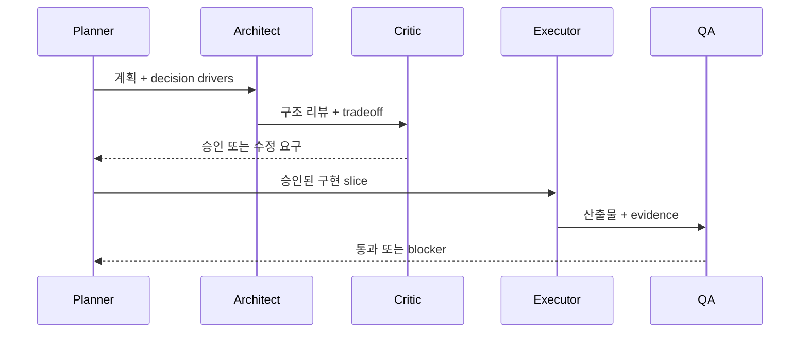

# 서브에이전트와 팀 조율

## 학습 목표

이 장의 목표는 여러 agent를 쓰는 것이 언제 품질을 높이고 언제 오히려 혼란을 만드는지 판단하는 법을 익히는 것입니다. 독자는 Planner, Architect, Critic, Executor, QA lane을 역할별로 분리하고, handoff와 evidence를 통해 조율하는 설계를 설명할 수 있어야 합니다.

## 요약

오케스트레이션은 병렬화 자체가 목적이 아닙니다. 역할별 책임, 파일 소유권, review 순서, 상태 기록, 실패 처리 방식을 정하는 설계입니다. 큰 작업은 독립 slice로 나눌 수 있을 때 병렬화하고, 설계·검토·비평은 순서가 필요한 경우가 많습니다.

## 핵심 개념

- **역할 분리**: Planner는 순서와 수용 기준, Architect는 구조와 tradeoff, Critic은 누락과 검증 가능성, Executor는 구현을 맡습니다.
- **handoff 계약**: 다음 agent가 무엇을 입력으로 받고 무엇을 출력해야 하는지 명시합니다.
- **파일 소유권**: 병렬 작업에서 같은 파일을 동시에 수정하면 충돌과 중복이 생깁니다.
- **review lane**: 구현과 별도의 read-only 검토 또는 red-team QA 경로입니다.

## 설계 패턴

### Sequential consensus loop

Planner → Architect → Critic처럼 앞 단계 산출물을 다음 단계가 검토해야 하는 경우 순차 실행이 안전합니다. Critic이 반려하면 Planner가 feedback을 반영하고 다시 리뷰합니다.

### Parallel implementation slices

서로 다른 파일 또는 표면을 독립적으로 바꿀 수 있으면 executor를 병렬로 사용할 수 있습니다. 단, 통합과 최종 검증은 leader가 책임집니다.

### Review lane isolation

검토 agent는 read-only로 두면 구현자 편향을 줄일 수 있습니다. Architect와 QA lane은 산출물과 승인된 plan/spec을 기준으로 blocker를 찾습니다.

## 기존 근거 링크

- [gajae-code 분석](../../harnesses/gajae-code.md): source-bundled workflow contracts와 role agent 구조를 봅니다.
- [omc 분석](../../harnesses/omc.md): Team verify/fix state loop를 봅니다.
- [아키텍처 비교](../../comparisons/architecture.md): plugin/CLI/runtime 경계가 오케스트레이션에 미치는 영향을 봅니다.
- [루프 엔지니어링 비교](../../comparisons/loop-engineering.md): review/fix 루프의 종료 조건을 비교합니다.

## 다이어그램

캡션: 역할 기반 오케스트레이션은 계획, 구조 리뷰, 비평, 구현, QA를 분리하고 산출물과 blocker를 명시적으로 전달합니다.

텍스트 설명: Planner가 계획을 만들고 Architect와 Critic이 검토합니다. 승인된 뒤 Executor가 구현하고 QA가 산출물과 evidence를 검증합니다. blocker가 있으면 다시 계획 또는 구현으로 돌아갑니다.

## 핵심 질문

- 이 작업은 병렬 slice로 나눌 수 있는가, 아니면 순차 검토가 필요한가?
- 각 agent의 입력, 출력, 금지 행동이 명확한가?
- reviewer가 구현을 직접 바꾸지 않고 blocker를 보고할 수 있는가?
- leader가 최종 통합과 checkpoint 책임을 갖고 있는가?

## 관련 링크와 Backlinks

- [학습 경로](../learning-path.md)
- [문서 맵](../document-map.md)
- [용어집 — 오케스트레이션](../glossary.md#20-오케스트레이션)
- [개념 색인 — Planner/Architect/Critic 합의](../concept-index.md)
- [패턴 색인 — Role-based orchestration](../pattern-index.md)
- [framework](../../framework.md)
