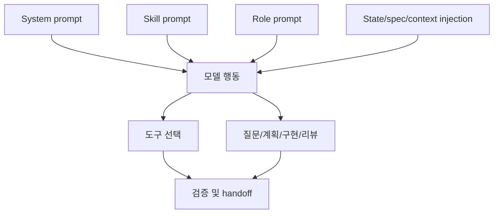

# 프롬프트와 역할 지시 설계

## 학습 목표

이 장의 목표는 프롬프트를 단순 문장 꾸러미가 아니라 **행동 계약과 역할 분리의 런타임 인터페이스**로 이해하는 것입니다. 독자는 system prompt, skill prompt, role prompt, prompt asset, runtime injection이 어떤 책임을 나누는지 설명할 수 있어야 합니다.

## 요약

프롬프트 엔지니어링은 모델에게 “무엇을 하라”만 쓰는 작업이 아닙니다. 하네스는 프롬프트로 도구 사용 우선순위, 금지 행동, 검증 의무, 역할 책임, 출력 형식, handoff 조건을 정의합니다. 좋은 프롬프트 설계는 workflow와 tool surface를 함께 고려합니다.

## 핵심 개념

- **System prompt**: 모든 행동의 기본 규칙과 도구 우선순위를 결정합니다.
- **Skill prompt**: 특정 workflow의 단계, 중지 조건, artifact 경로, 권한 경계를 정의합니다.
- **Role prompt**: Planner, Architect, Critic, Executor 같은 역할별 책임과 금지 행동을 정의합니다.
- **Prompt asset**: 모델별 또는 역할별 지시를 파일/번들로 관리해 재사용합니다.
- **Runtime injection**: 현재 state, spec, codebase facts, challenge mode 등을 prompt에 합성합니다.

## 설계 패턴

### Role contract prompt

역할 프롬프트는 “잘 해라”가 아니라 책임과 금지 행동을 명확히 합니다. Architect는 read-only review, Executor는 bounded implementation, Critic은 plan critique처럼 역할별 성공 기준이 다릅니다.

### Stage-gated prompt

Deep Interview, Ralplan, Ultragoal처럼 단계별 권한이 다른 workflow에서는 prompt가 mutation boundary를 지켜야 합니다. 요구 수집 단계는 source edit을 금지하고, 실행 단계는 검증 gate를 요구합니다.

### Model-specific prompt asset

모델별 형식이나 provider 차이가 크면 prompt asset catalog가 필요합니다. 이 패턴은 opencode의 model prompt asset이나 모델 라우팅 설계와 연결됩니다.

## 기존 근거 링크

- [프롬프트 엔지니어링 비교](../../comparisons/prompt-engineering.md): 여섯 하네스의 prompt surface 차이를 비교합니다.
- [opencode 분석](../../harnesses/opencode.md): 모델별 prompt asset 접근을 확인합니다.
- [omc 분석](../../harnesses/omc.md): skill·role Markdown injection을 확인합니다.
- [gajae-code 분석](../../harnesses/gajae-code.md): source-bundled workflow contracts와 role agents를 확인합니다.

## 다이어그램

캡션: 프롬프트 설계는 system, skill, role, runtime context를 합성해 모델 행동과 도구 선택을 제한합니다.

텍스트 설명: 모델은 하나의 prompt만 받는 것이 아니라 기본 규칙, workflow 규칙, 역할 계약, 현재 state/spec/context를 동시에 받습니다. 이 합성 결과가 도구 선택과 산출물 형식을 결정합니다.

## 핵심 질문

- 이 지시는 system, skill, role, runtime context 중 어디에 있어야 하는가?
- 역할별 금지 행동과 완료 기준이 명시되어 있는가?
- prompt가 workflow 단계의 권한 경계를 넘어서고 있지 않은가?
- 모델별 차이는 prompt asset으로 관리할 문제인가, routing/adapter로 관리할 문제인가?

## 관련 링크와 Backlinks

- [학습 경로](../learning-path.md)
- [문서 맵](../document-map.md)
- [용어집 — 프롬프트 asset](../glossary.md#11-프롬프트-asset)
- [개념 색인 — 프롬프트 asset](../concept-index.md)
- [패턴 색인 — Prompt asset catalog](../pattern-index.md)
- [framework](../../framework.md)
