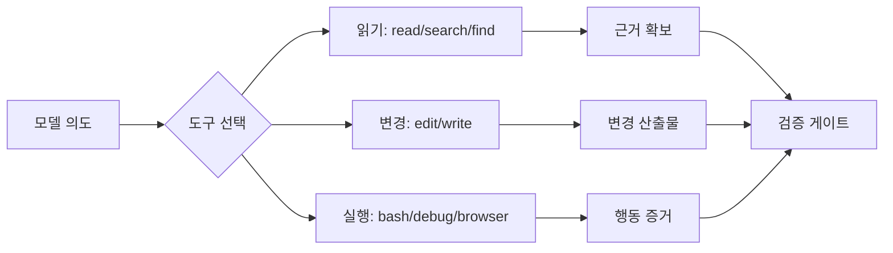

# 도구 표면과 권한 경계

## 학습 목표

이 장의 목표는 AI 코딩 하네스에서 “모델에게 어떤 도구를 줄 것인가”와 “그 도구를 어디까지 허용할 것인가”를 분리해서 판단하는 법을 익히는 것입니다. 독자는 도구 표면이 넓을수록 자동으로 좋은 것이 아니라, 권한 경계와 검증 루프가 함께 있어야 한다는 점을 이해해야 합니다.

## 요약

도구 표면은 모델이 세계를 조작하는 인터페이스입니다. 파일 읽기, 검색, 편집, 셸, 브라우저, LSP, 디버거, 서브에이전트는 모두 다른 위험과 장점을 가집니다. 하네스 설계자는 도구를 추가할 때마다 “어떤 행동을 가능하게 하는가?”, “어떤 실패가 생기는가?”, “어떤 검증으로 닫는가?”를 같이 정해야 합니다.

## 핵심 개념

- **도구 표면**: 모델이 호출할 수 있는 조작 가능한 API 집합입니다.
- **권한 경계**: 파일, 명령, 네트워크, 상태, 외부 프로세스 접근 제한입니다.
- **도구 우선순위**: 파일 읽기에는 read, 검색에는 search, refactor에는 LSP처럼 안전한 전용 도구를 먼저 쓰게 하는 규칙입니다.
- **권한 있는 실패**: 도구 호출이 실패했을 때 fallback이 문제를 숨기지 않고 원인을 드러내도록 설계해야 합니다.

## 설계 패턴

### Dedicated-tool-first policy

범용 shell 하나로 모든 것을 처리하게 두면 읽기·검색·편집·검증의 경계가 흐려집니다. 전용 도구를 우선하게 하면 audit trail과 안전성이 좋아집니다. 이 패턴은 `read/search/find/edit/lsp` 같은 도구 구분에 특히 중요합니다.

### Permissioned mutation boundary

읽기 도구와 mutation 도구를 분리하고, 계획/검토 단계에서는 mutation을 금지합니다. Deep Interview와 Ralplan이 source edit을 하지 않는 것도 같은 패턴입니다.

### Hook guardrail

도구 호출 전후에 정책을 검사하는 hook은 권한 경계를 강화합니다. 다만 hook이 많아지면 행동 원인을 추적하기 어려워지므로 문서화와 receipt가 필요합니다.

## 기존 근거 링크

- [opencode 분석](../../harnesses/opencode.md): 기본 도구·권한 substrate의 기준선을 봅니다.
- [omc 분석](../../harnesses/omc.md): all-event hook mesh와 verify/fix 흐름을 봅니다.
- [lazycodex 분석](../../harnesses/lazycodex.md): external process hook bundle을 봅니다.
- [하네스 엔지니어링 비교](../../comparisons/harness-engineering.md): 도구 표면과 권한 경계가 어떻게 비교되는지 봅니다.

## 다이어그램

캡션: 도구 표면은 읽기, 변경, 실행 계열로 나뉘며 모든 계열은 검증 게이트로 닫혀야 합니다.

텍스트 설명: 모델의 의도는 도구 선택으로 구체화됩니다. 읽기 도구는 근거를 만들고, 변경 도구는 산출물을 만들며, 실행 도구는 행동 증거를 만듭니다. 세 결과 모두 완료 전 검증 게이트를 통과해야 합니다.

## 핵심 질문

- 이 도구는 어떤 새 행동을 가능하게 하는가?
- 같은 목적을 더 좁고 안전한 전용 도구로 달성할 수 있는가?
- 권한 실패나 도구 실패가 발생했을 때 하네스는 어떻게 드러내는가?
- mutation이 허용되는 단계와 금지되는 단계가 분리되어 있는가?

## 관련 링크와 Backlinks

- [학습 경로](../learning-path.md)
- [문서 맵](../document-map.md)
- [용어집 — 도구 표면](../glossary.md#7-도구-표면)
- [개념 색인 — 도구 표면 설계](../concept-index.md)
- [패턴 색인 — 기본 도구·권한 substrate](../pattern-index.md)
- [framework](../../framework.md)
