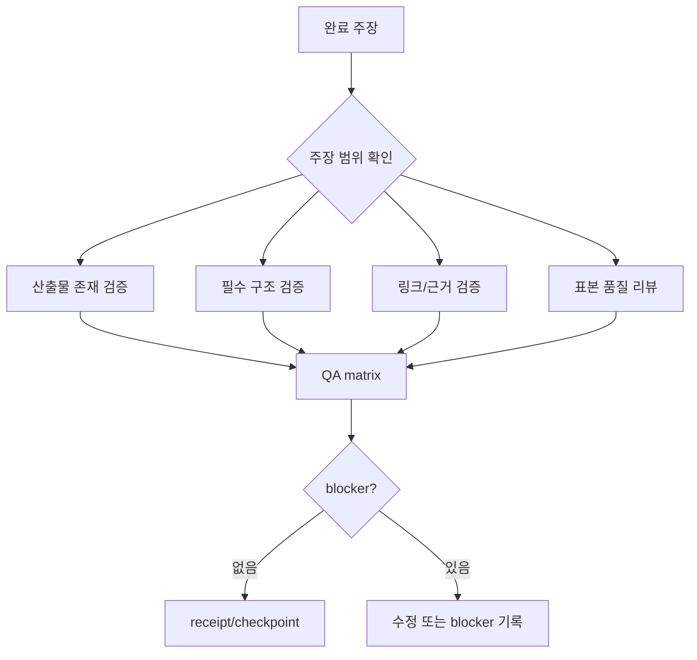

# 완료 주장 검증

## 학습 목표

이 장의 목표는 AI agent가 “완료”라고 말할 때 그 말이 무엇으로 증명되는지 판단하는 법을 익히는 것입니다. 독자는 테스트, 파일 존재, 링크 검증, reviewer approval, QA matrix, receipt를 구분하고, 완료 주장에 맞는 검증 범위를 설계할 수 있어야 합니다.

## 요약

완료 주장은 산출물과 증거가 있어야 의미가 있습니다. 좁은 파일 하나를 확인하고 전체 기능이 끝났다고 말하면 검증 범위가 맞지 않습니다. 이 레포의 기존 분석은 고정 SHA permalink, AC3a/AC3b, README 매트릭스 링크 검증처럼 문서형 프로젝트에 맞는 검증을 사용했습니다. 학습 레이어도 같은 원칙을 따릅니다.

## 핵심 개념

- **Evidence**: 완료를 뒷받침하는 파일, 명령 출력, 링크 검증, 리뷰 결과, QA matrix.
- **Verification scope**: 주장의 범위와 검증 범위가 일치해야 합니다.
- **AC3a**: permalink 경로와 line range가 실제로 존재하는지 기계 검증합니다.
- **AC3b**: 표본 검토로 source claim 왜곡 여부를 확인합니다.
- **Quality gate**: architect review, executor QA, cleanup sweep, rerun evidence를 묶어 통과 여부를 판단합니다.

## 설계 패턴

### Claim-scope matching

“파일 작성 완료”는 파일 존재와 필수 섹션으로 검증할 수 있습니다. “학습 교과서 완성”은 전체 expected file list, 색인 수량, 링크 품질, diagram marker, sample review까지 필요합니다.

### Machine check + human sample

기계 검증은 링크와 섹션 누락을 빠르게 찾습니다. 하지만 글의 학습 흐름, 근거 왜곡, tradeoff 설명의 질은 표본 리뷰가 필요합니다.

### Red-team QA matrix

QA는 happy path만 확인하지 않습니다. 누락된 섹션, 잘못된 링크, scope drift, 임시 문구, 과장된 완료 주장을 일부러 찾습니다.

## 기존 근거 링크

- [framework](../../framework.md): 인용 규칙, 부재 증명, 검증 기준을 제공합니다.
- [README 검증 기준](../../README.md#검증-기준): 기존 레포의 문서 검증 기준입니다.
- [gajae-code 분석](../../harnesses/gajae-code.md): workflow·receipt ledger loop와 completion gate를 확인합니다.
- [루프 엔지니어링 비교](../../comparisons/loop-engineering.md): 완료 조건과 재검증 방식의 차이를 비교합니다.

## 다이어그램

캡션: 완료 검증은 주장 범위에 맞춰 산출물, 구조, 링크, 품질 표본을 확인하고 blocker가 없을 때만 receipt/checkpoint로 닫습니다.

텍스트 설명: 완료 주장을 먼저 범위로 나누고, 파일 존재·필수 구조·링크 근거·품질 표본을 확인합니다. QA matrix에 blocker가 없으면 checkpoint하고, blocker가 있으면 수정 또는 blocker 기록으로 돌아갑니다.

## 핵심 질문

- 지금 완료 주장은 파일 하나인가, 목표 전체인가?
- 검증 명령이나 스크립트가 주장 범위 전체를 덮는가?
- 기계 검증으로 잡히지 않는 품질 문제는 어떤 표본 리뷰로 확인할 것인가?
- receipt가 실제 evidence를 요약하는가, 아니면 빈 형식만 채우는가?

## 관련 링크와 Backlinks

- [학습 경로](../learning-path.md)
- [문서 맵](../document-map.md)
- [용어집 — 검증 게이트](../glossary.md#15-검증-게이트)
- [개념 색인 — citation discipline](../concept-index.md)
- [패턴 색인 — Evidence-linked comparison](../pattern-index.md)
- [framework](../../framework.md)
